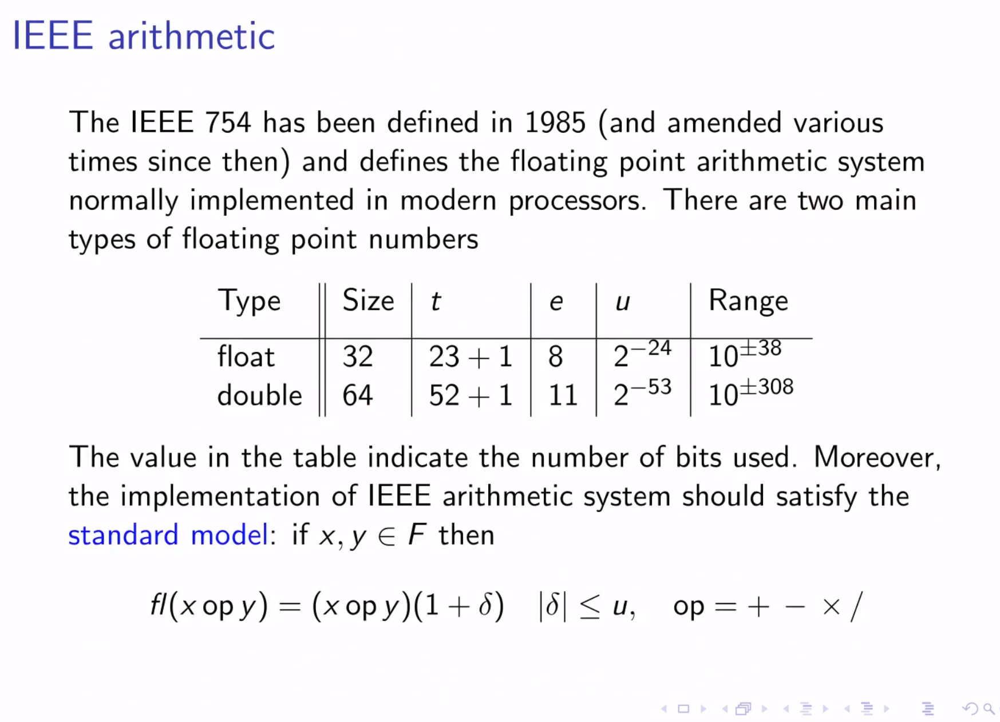

# Notes from lecture 2: floating point arithmetic

## Basic definition

- Floating point numbers are represented as a sign bit, an exponent and a mantissa (or significand).
- The exponent is stored in a biased form, meaning that a fixed value (bias) is added to the actual exponent to obtain the stored exponent. This allows for both positive and negative exponents to be represented.
- Often, the mantissa is normalized, meaning that the leading digit is always 1 (for binary numbers). This allows for a more efficient representation of the number.

- The reason why the basis of the floating point arithmetic is 2, is the fact that storage and error checking is simpler when working with only two values (0 and 1, binary code).

### Machine precision

- The machine precision is the smallest number that can be added to 1.0 while still being able to distinguish the sum from 1.0. This is also known as the machine epsilon.
- The roundoff unit $u$ is defined as $u = 0.5 * \epsilon_{M}.$
This is such that: $$1.0 + u = 1.0.$$

### IEEE 754 standard

- The standard also prescribes the representation of special values:
  - NaN (Not a Number): used to represent undefined or unrepresentable values, such as the result of 0/0. Essentially, it is used to indicate invalid operations. Any operation with NaN will result in NaN.
  - Infinity: used to represent overflow or division by zero.

- Note that underflow/overflow conditions do **not** stop the computations, but rather produce special values (0, NaN, Inf). This is for performance reasons (i.e., to avoid checking each single arithmetic operation). However, a floating point exception may be recorded in some architectures.

### Forward and backward error analysis

- Forward error analysis: measures the error in the output of a function due to errors in the input. It is defined as the difference between the exact output and the computed output.
- Backward error analysis: measures the error in the input of a function due to errors in the output.
- The **condition number** is defined as the ratio of the relative change in the output to the relative change in the input. That is, it measures how sensitive the output of a function is to changes in the input. It is defined as:

$$
\kappa(f) = \frac{\partial f}{\partial x} \cdot \frac{x}{f(x)}
$$

- **IMPORTANT**: the subtraction of almost equal floating point numbers can lead to cancellation phenomena (big round-off errors). Avoid it when possible.

#### Interesting note

The reason why lower precision floating point numbers are useful in machine learning is that input and output are often pre-normalized such that a network only requires a tiny small interval of values (between 0 and 1) for the computation.

#### Example: numerical differentiation

- Due to the cancellation phenomena, the 2nd order finite difference method may not be really better than the 1st order forward difference. This is due to the division by a small number multiplied by 2. For instance, the error curve for a simple function:

- Differentiation may be made more robust using the Cauchy-Riemann equation, resorting to complex numbers:

$$ f(x+ih) = f(x) + ih\frac{df}{dx} + O(h^2)$$

Note that here $Im\left(\frac{f(x+ih)}{h}\right)$ is the 2nd order derivative of $f'$ at $x$. This does not use differencing, ensuring cancellation phenomena are prevented, while also allowing very small h steps.

#### Example 2: Quadratic root finding

Round-off error can be important in solving quadratic equations when $|b| >> ac$ due to cancellation errors.

- Note that this can lead to incorrect results for instance when computing intersection of quadrics. See FloatingPoint/QuadraticRoot example for a method to reduce cancellation error.
- See FloatingPoint/FPFailure for additional examples.

### Programming tips

- Never ever compare two FP numbers for equality. Use `std::abs` and tolerances.
- Use `long double` for extended precision.
- To get machine precision in C++, use `std::numeric_limits<precision>::epsilon()`. Numeric limits can be used to get any information about numerical types in C++. For instance, `std::numeric_limits<type>::rounding_style()` returns the rounding style of the type.
- Several useful iomanip functions for printing:
  - `std::setprecision(int)` to set the precision to be printed
  - `std::scientific` to print in scientific notation
  - `ostream.precision(int)` to set precision to write numbers to a file
- Use `std::setprecision` to set the precision of floating point numbers when printing them to the console or a file.
- Remember that the maximum number of significant digits of a double precision number is 15, because it is the maximum number of digits in the mantissa!
